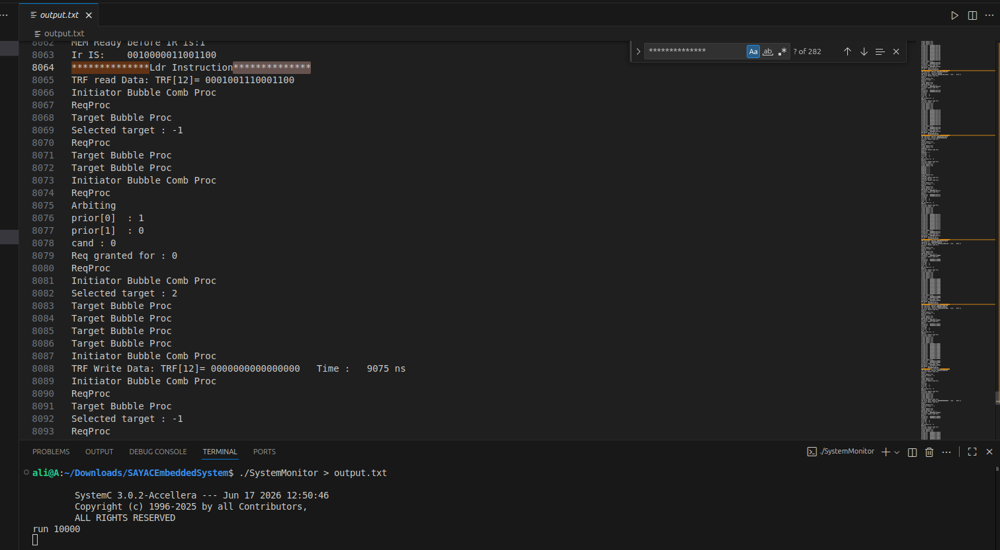
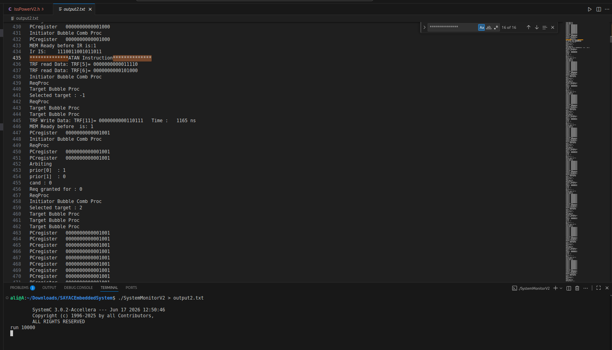

# SAYAC GPS Navigation with Custom Instructions

> **Academic Coursework Repository**  
> This repository contains our solution for a university assignment on hardware/software co-design using the SAYAC embedded processor. It is published for educational and portfolio purposes only. The implementation and report reflect our own work within the scope of the course assignment.

## Overview

Modern mail-delivery drones rely on GPS coordinates for navigation. However, flight control algorithms require the distance and heading angle to the destination rather than raw coordinates. This project implements these computations on the SAYAC processor and investigates the performance benefits of extending the ISA with application-specific custom instructions.

The project consists of:

- A software-only implementation written in C.
- An accelerated implementation featuring dedicated `DIST` and `ATAN` instructions.
- A quantitative comparison of execution time and architectural trade-offs.

## Features

- Euclidean distance and heading-angle computation from GPS coordinates.
- Cycle-accurate simulation on the SAYAC SystemC model.
- Design and integration of two custom instructions.
- Performance evaluation of software versus hardware-assisted execution.
- Discussion of area, power, cost, and latency trade-offs.

## Architecture

The accelerated design introduces two dedicated functional units:

1. **DIST** – Computes \(\sqrt{\Delta x^2+\Delta y^2}\).
2. **ATAN** – Estimates the navigation angle from \(\Delta y/\Delta x\).

These units are exposed to software through new ISA instructions, reducing instruction count and execution time.

## Screenshots

| Software Execution | Custom Instructions |
| :---: | :---: |
|  |  |

## Repository Structure

```text
software-implementation/    Software-only implementation and simulation artifacts
custom-instructions/        ISA extensions and accelerated implementation
docs/                       Assignment statement and final report
images/                     Timing screenshots used in the README
```

## Technologies

- C
- C++
- SystemC
- SAYAC Embedded Processor
- Custom ISA Extension Design

## Prerequisites

This project builds upon the official SAYAC processor model:

- https://github.com/RHESGroup/SAYAC-Embedded-Processor

The associated compiler and assembler can be found at:

- https://github.com/Rayhaneh-Einollahi/SAYAC_Compiler

## Running the Simulations

```bash
# Compile the required SystemC sources (including SystemMonitor)
g++ ...
```

Generate the binary using the SAYAC compiler, place the resulting bitstream into `binfile.txt`, start the simulator, and execute:

```text
run 10000
```

The argument denotes the simulation duration in nanoseconds.

## Results

| Configuration | Execution Time |
| --- | ---: |
| Software-only | ~9000 ns |
| With Custom Instructions | ~1200 ns |

The custom-instruction approach achieves an approximate 7.5× speedup.

## Lessons Learned

This assignment demonstrates the effectiveness of hardware/software co-design. While custom instructions can provide substantial performance and energy benefits, they also increase hardware complexity, area, and development cost.

## Future Improvements

- Implement a more accurate arctangent unit.
- Develop a fully verified compiler backend supporting the new instructions.
- Add automated regression tests and continuous integration.

## Authors

- Ali Dehghani

## License

Distributed under the MIT License. See `LICENSE` for details.